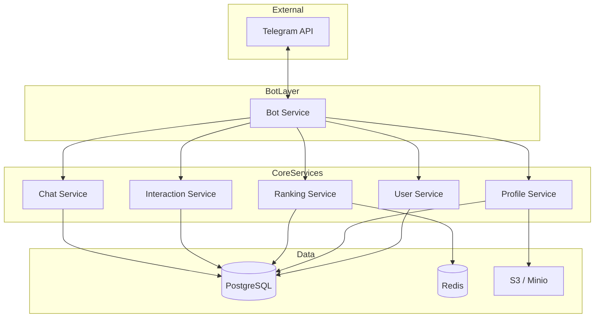

# Этап 1: Архитектура и дизайн системы

## Высокоуровневая схема

```
                    ┌─────────────────┐
                    │    Telegram     │
                    │      API       │
                    └────────┬───────┘
                             │
                             ▼
┌────────────────────────────────────────────────────────────────────────────┐
│                         BOT SERVICE (Gateway)                               │
│  • Команды /start, /help, меню                                              │
│  • FSM: регистрация → анкета → просмотр анкет → чат                         │
│  • Валидация, уведомления                                                   │
└──┬─────────────┬─────────────┬─────────────┬─────────────┬─────────────────┘
   │             │             │             │             │
   ▼             ▼             ▼             ▼             ▼
┌──────┐   ┌──────────┐  ┌──────────┐  ┌──────────┐  ┌──────────────┐
│User  │   │ Profile  │  │ Ranking  │  │Interaction│  │ Chat         │
│Svc   │   │ Service  │  │ Service  │  │ Service   │  │ Service      │
└──┬───┘   └────┬─────┘  └────┬─────┘  └────┬─────┘  └──────┬───────┘
   │            │             │             │               │
   └────────────┴──────┬──────┴──────┬──────┴───────────────┘
                       │             │
                       ▼             ▼
              ┌─────────────┐  ┌──────────┐
              │  PostgreSQL │  │  Redis   │
              │  (основная  │  │  (кэш    │
              │   БД)       │  │  анкет)  │
              └─────────────┘  └──────────┘
                       │
                       ▼
              ┌─────────────┐
              │ S3 / Minio  │
              │ (фото)      │
              └─────────────┘
```

## Диаграмма потоков данных (Mermaid)



## Сценарии использования

### 1. Регистрация и создание анкеты

```
User → Telegram /start → Bot → User Service (create/get by telegram_id)
     → Bot → Profile Service (create/update profile, upload photos)
     → Сохранение в DB и S3
```

### 2. Просмотр анкет (лайк/пас)

```
User → "Смотреть анкеты" → Bot → Ranking Service (get next profiles, from Redis or DB)
     → Bot → Profile Service (get profile details + photos)
     → Показ анкеты пользователю
User → Лайк/Пас → Bot → Interaction Service (record like/pass)
     → Ranking Service (invalidate/update cache, behavioral rating)
     → При взаимном лайке: Interaction → create match → Chat Service (open chat)
```

### 3. Чат после мэтча

```
User → Выбор мэтча → Bot → Chat Service (get history)
User → Сообщение → Bot → Chat Service (save message, notify partner)
```

## Компоненты для последующих этапов

| Этап   | Компонент        | Роль                                      |
|--------|------------------|-------------------------------------------|
| 2–3    | Redis            | Кэш очереди анкет для быстрого показа      |
| 3      | Celery           | Периодический пересчёт рейтингов           |
| 3–4    | MQ (Kafka/RabbitMQ) | События лайков/пасов для ранжирования  |
| 4      | Метрики, логи    | Мониторинг и отладка                      |

## Масштабирование

- **Bot Service:** можно запускать несколько инстансов за балансировщиком; состояние FSM хранить в Redis.
- **Сервисы:** при росте нагрузки — разделение на отдельные процессы/контейнеры, общение по HTTP или через MQ.
- **БД:** репликация чтения для Ranking и Profile при высокой нагрузке.
