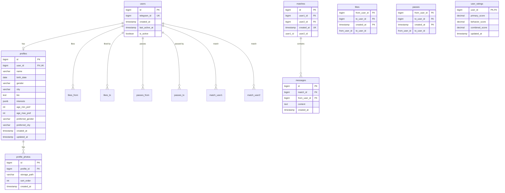

## ER-диаграмма (Mermaid)

## Описание таблиц

| Таблица | Назначение |
|--------|------------|
| **users** | Пользователи системы; ключ входа — `telegram_id`. |
| **profiles** | Анкета: имя, возраст (из birth_date), пол, город, описание, интересы, предпочтения по возрасту/полу/городу. |
| **profile_photos** | Фото анкеты; `storage_path` — ключ в S3/Minio. |
| **likes** | Кто кого лайкнул (from → to). |
| **passes** | Кто кого пропустил (для поведенческого рейтинга). |
| **matches** | Пара пользователей при взаимном лайке. |
| **messages** | Сообщения в рамках мэтча. |
| **user_ratings** | Рейтинги для ранжирования: первичный, поведенческий, комбинированный. |

## Индексы (основные)

- `users.telegram_id` — UNIQUE, поиск при /start.
- `profiles.user_id` — UNIQUE (один профиль на пользователя).
- `likes (from_user_id, to_user_id)` — UNIQUE, проверка мэтча.
- `passes (from_user_id, to_user_id)` — UNIQUE.
- `matches (user1_id, user2_id)` — UNIQUE; порядок user1 < user2 для консистентности.
- `messages (match_id, created_at)` — выборка истории чата.
- `user_ratings` — пересчёт по расписанию (Celery).

Файл `03-database-schema.sql` содержит DDL для создания таблиц в PostgreSQL.
