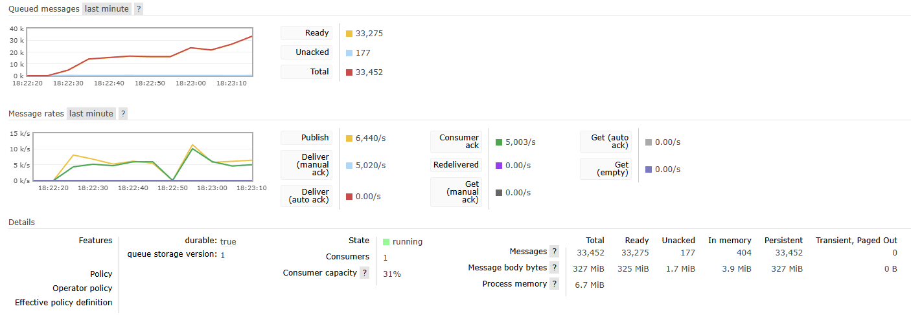
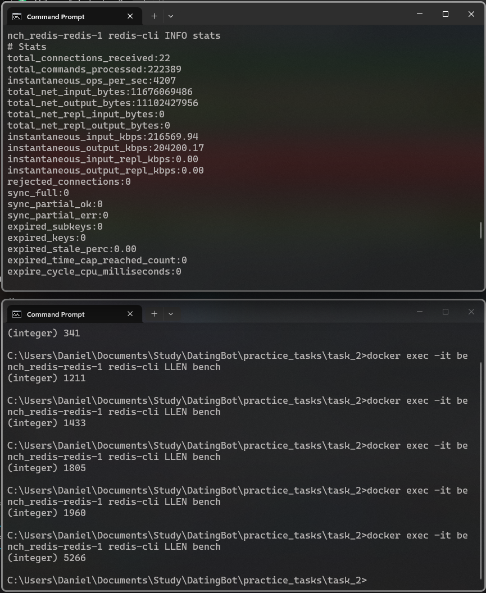
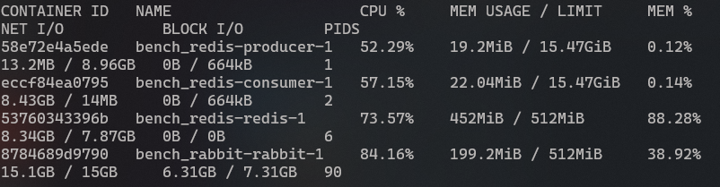

# Сравнение RabbitMQ и Redis как брокеров сообщений

## Цель работы

Сравнить RabbitMQ и Redis в одних и тех же условиях как брокеры сообщений. Нужно получить конкретные цифры по пропускной способности, задержке, влиянию размера сообщения и найти момент, когда single instance перестает справляться.

## Что было сделано

Собран стенд из трёх частей: producer, брокер и consumer. Producer и consumer
одинаковые для обоих брокеров. Они собраны в один и тот же Docker образ, разница
только в переменной окружения `BROKER_KIND`. Брокеры запускались по очереди.

Схема прогона:
1. Поднимается контейнер брокера (RabbitMQ или Redis).
2. Стартует consumer и начинает слушать очередь.
3. Стартует producer, отсылает поток сообщений заданной интенсивности в течение
   30 секунд.
4. Consumer читает всё что пришло, после 5 секунд тишины выходит и пишет метрики.
5. Стек гасится, данные ячейки сохраняются в `results/raw/*.json`.

Для каждого сообщения producer кладёт в payload 8 байт номера и 8 байт временной
метки отправки, остальное заполняется нулями до нужного размера. Consumer по
полученному сообщению сразу считает latency как разницу между временем приёма и
временем отправки. Часы в контейнерах одни и те же (это часы хоста), поэтому
расхождений нет.

### Условия

| Параметр | Значение |
|----------|----------|
| RabbitMQ | 3.13 management alpine, durable queue, `delivery_mode=2` (persistent), prefetch 256 |
| Redis    | 7.4 alpine, очередь на базе LIST (`RPUSH` / `BLPOP` / `LLEN`) |
| Лимиты брокера | 1 CPU, 512 MB RAM |
| Клиентские библиотеки | `pika==1.3.2`, `redis==5.2.1` (обе синхронные) |
| Размеры сообщений | 128 B, 1 KB, 10 KB, 100 KB |
| Интенсивности | 1 000, 5 000, 10 000 msg/s |
| Длительность ячейки | 30 секунд |
| Всего прогонов | 24 (2 брокера * 4 размера * 3 интенсивности) |

## Как читать таблицы

В результирующем CSV есть две колонки со скоростями: `actual_rate_in` и
`actual_rate_out`. Первая считается у producer как `sent / 30s` и показывает,
сколько реально удалось поместить в брокер. Это главный индикатор: если эта
цифра меньше целевой, значит брокер не принимает поток достаточно быстро.
Вторая считается у consumer как `received / wall_time`, но wall_time у consumer
на 5–8 секунд больше из-за idle-таймаута на выходе, поэтому она занижена
примерно до 79% от target даже когда всё идеально. Во всех 24 ячейках
`sent == received` и потерь не было, так что реальная скорость consumer
равна `actual_rate_in`.

## Результаты

### Эксперимент 1. Базовое сравнение

Одинаковый прогон для двух брокеров: сообщение 1 KB, 1 000 msg/s, 30 секунд.

| Брокер   | Отправлено | Получено | Потери | avg, ms | p95, ms | max, ms | Пик backlog |
|----------|-----------:|---------:|-------:|--------:|--------:|--------:|------------:|
| RabbitMQ |     30 001 |   30 001 |      0 |   2.32  |  19.08  |  53.46  |       0     |
| Redis    |     30 001 |   30 001 |      0 |   0.18  |   0.34  |   2.11  |       0     |

На низкой нагрузке оба справляются без очереди. По задержке Redis быстрее примерно
в 56 раз по p95. Причина в том, что RabbitMQ пишет каждое сообщение на диск
(durable queue плюс persistent delivery mode), а Redis работает целиком в оперативной памяти.

### Эксперимент 2. Влияние размера сообщения

Интенсивность 1 000 msg/s фиксирована, меняется только размер. Оба брокера при
такой нагрузке держат target на всех размерах вплоть до 100 KB (то есть до
100 MB/s через loopback). Интересна разница по задержкам.

| Размер | RabbitMQ p95, ms | Redis p95, ms | Во сколько раз Redis быстрее |
|--------|-----------------:|--------------:|-----------------------------:|
| 128 B  |            14.35 |          0.34 |                        42    |
| 1 KB   |            19.08 |          0.34 |                        56    |
| 10 KB  |            36.54 |          0.37 |                        99    |
| 100 KB |           276.49 |          0.45 |                       614    |

У Redis p95 почти не зависит от размера сообщения. У RabbitMQ p95 растёт вместе
с размером, причём нелинейно: на 100 KB рост по отношению к 1 KB примерно
в 14 раз. Это тоже эффект дискового fsync на каждое сообщение.

### Эксперимент 3. Влияние интенсивности потока

Размер сообщения фиксирован на 1 KB, меняется интенсивность.

| Target, msg/s | Брокер   | actual_rate_in | Потери | p95, ms | Пик backlog |
|--------------:|----------|---------------:|-------:|--------:|------------:|
|         1 000 | RabbitMQ |        1000.03 |      0 |   19.08 |        0    |
|         1 000 | Redis    |        1000.03 |      0 |    0.34 |        0    |
|         5 000 | RabbitMQ |        5000.01 |      0 |  118.68 |        0    |
|         5 000 | Redis    |        5000.00 |      0 |    0.22 |        1    |
|        10 000 | RabbitMQ |       10000.00 |      0 |  683.33 |      311    |
|        10 000 | Redis    |        9999.24 |      0 |   43.21 |      512    |

На 1 KB оба выдерживают 10 000 msg/s без потерь. Но у RabbitMQ p95 уже 683 мс,
а у Redis 43 мс. Разрыв сокращается с ростом нагрузки, но Redis всё равно
быстрее в 16 раз.

### Когда single instance не справляется

Есть набор ячеек, в которых брокер уже не
принимает целевой поток: `actual_rate_in` проседает значительно ниже target.

**RabbitMQ.**

| Ячейка            | target    | actual_rate_in | % от target | p95, ms | Пик backlog |
|-------------------|----------:|---------------:|------------:|--------:|------------:|
| 10 KB × 10 000    |    10 000 |          6 082 |        61 % |   3 808 |      22 580 |
| 100 KB × 5 000    |     5 000 |          1 508 |        30 % |   1 820 |       2 563 |
| 100 KB × 10 000   |    10 000 |          1 496 |        15 % |   2 374 |       2 577 |

Видно, что на 100 KB RabbitMQ не тянет больше примерно 1 500 msg/s в принципе,
независимо от того, просят у него 5k или 10k. Это потолок диска брокера в наших
условиях.

**Redis.**

| Ячейка            | target    | actual_rate_in | % от target | p95, ms | Пик backlog |
|-------------------|----------:|---------------:|------------:|--------:|------------:|
| 10 KB × 10 000    |    10 000 |          8 566 |        86 % |     2.5 |         20  |
| 100 KB × 10 000   |    10 000 |          3 441 |        34 % |   7 179 |       6 222 |

Redis держит 10 KB × 10 000 почти на 86% target и latency остаётся миллисекундной.
Упирается только на 100 KB × 10 000, где физически нужно прогнать около 1 GB
данных за 30 секунд через клиента на одном ядре Python.

Для наглядности ячейки, где Redis ещё держит, а RabbitMQ уже не справляется:

| Ячейка         | RabbitMQ: actual_rate_in / p95 | Redis: actual_rate_in / p95  |
|----------------|-------------------------------:|-----------------------------:|
| 10 KB × 10 000 |          6 082 / 3 808 ms      |          8 566 / 2.5 ms      |
| 100 KB × 5 000 |          1 508 / 1 820 ms      |          5 000 / 20 ms       |

Разница на порядок как по пропускной способности, так и по latency.

## Скриншоты

### RabbitMQ management UI под нагрузкой

Показан момент saturated ячейки (`10 KB × 10 000 msg/s`). На графике Queued
messages видно накопление backlog'а. На Message rates видно, что incoming поток
опережает deliver, именно из-за этого у RabbitMQ получился `actual_rate_in`
равный 6 082, а не 10 000.

### Redis под нагрузкой

Вывод `redis-cli INFO stats` и `LLEN bench` во время прогона Redis с большими
сообщениями. Видно `instantaneous_ops_per_sec` и размер очереди.

### Docker stats

CPU и память контейнеров во время прогона. У контейнера брокера загрузка CPU
близка к потолку в 1 ядро, что и ожидалось.

## Выводы

1. **Пропускная способность.**
   На 1 KB сообщении оба брокера выдерживают 10 000 msg/s без потерь.
   С увеличением размера сообщения RabbitMQ проседает раньше: на 100 KB его
   потолок около 1 500 msg/s, тогда как Redis на той же ячейке держит 5 000 msg/s.
   В пике single instance (`10 KB × 10 000 msg/s`) Redis выдаёт на 40% больше
   сообщений, чем RabbitMQ, и с задержкой в 1 500 раз меньше.

2. **Работа с разным размером сообщения.**
   У Redis задержка почти не зависит от размера сообщения при фиксированной
   нагрузке 1 000 msg/s: от 0.34 мс на 128 B до 0.45 мс на 100 KB. У RabbitMQ
   задержка растёт пропорционально размеру и на 100 KB доходит до 276 мс по p95.
   Причина в том, что RabbitMQ пишет каждое сообщение на диск, а Redis работает
   в памяти. На больших сообщениях разница становится особенно заметной.

3. **Когда single instance перестаёт справляться.**
   RabbitMQ начинает проседать по входному потоку уже на 10 KB × 10 000 msg/s
   (принимает 61% target) и полностью перестаёт тянуть нагрузку на 100 KB × 5 000 msg/s
   (только 30% target). Потерь при этом нет, сообщения просто копятся в очереди
   на стороне producer или отправляются медленнее. Redis проседает только на
   экстремальной ячейке 100 KB × 10 000 msg/s (34% target). На всех остальных
   комбинациях он принимает целевой поток.

4. **Когда что брать.**
   Redis в конфигурации LIST хорош как быстрая очередь для сценариев, где важна
   низкая задержка и высокая пропускная способность, а durability не критична.
   Он очень хорошо переносит большие сообщения. RabbitMQ стоит брать там, где
   нужны durable очереди, ack, возможность работы с несколькими consumers, и
   где прогнозируемое поведение важнее пиковой скорости. Нужно учитывать, что
   ценой durability будет более высокая задержка и меньшая максимальная
   пропускная способность на больших сообщениях.