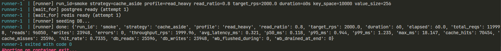
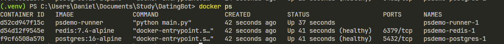
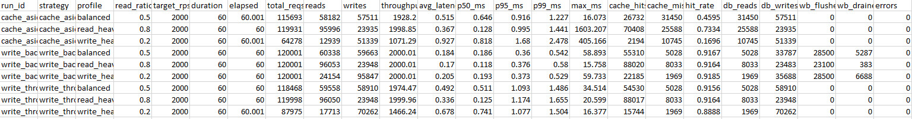
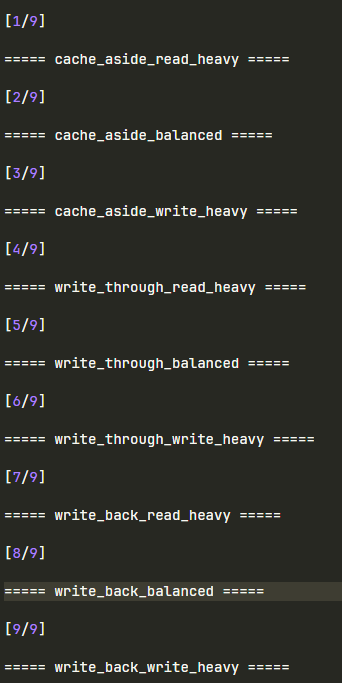

# Сравнение типов кеширования: Cache-Aside, Write-Through, Write-Back

## Цель работы

Реализовать одну и ту же систему «приложение, кеш, БД» в трёх вариантах
работы с кешем и сравнить их в одних и тех же условиях. Нужно получить
конкретные цифры по пропускной способности, средней задержке, числу
обращений в БД и hit rate кеша на трёх профилях нагрузки (read-heavy,
balanced, write-heavy).

## Что было сделано

Собран стенд из трёх частей: `runner` (приложение и встроенный
генератор нагрузки), Redis (кеш) и PostgreSQL (БД). Все три стратегии
реализованы в одном Docker-образе, переключение происходит через
переменную окружения `STRATEGY`. Стратегии меняют только то, как
`runner` ходит в кеш и в БД. Сам тест и инфраструктура одинаковые.

Схема прогона ячейки:
1. Поднимается Postgres и Redis
2. `runner` создаёт схему `items(key, value, updated_at)`, чистит таблицу
   и Redis, заливает в БД `KEY_SPACE` строк (равномерное value-наполнение).
   Кеш стартует пустым, чтобы первые чтения шли в БД.
3. `runner` запускает workload длительности `DURATION_SEC` с целевым
   `TARGET_RPS` через deadline-based pacer. На каждый тик берётся
   случайный ключ из `[0..KEY_SPACE)`, с вероятностью `READ_RATIO` это
   read, иначе write.
4. На каждой операции замеряется client-side latency
   (`time.perf_counter()`). Кеш и БД считают свои операции.
5. Для `write_back` отдельный фоновый поток-flusher раз в `FLUSH_INTERVAL`
   вынимает из Redis SET `dirty_set` пачку ключей через `SPOP`, читает их
   значения через `MGET` и делает batch-UPSERT в БД. Параллельный сэмплер
   раз в 200 мс пишет размер `dirty_set` в таймсерию.
6. После окончания workload фоновый flusher останавливается, оставшийся
   `dirty_set` дочищается, чтобы БД пришла в консистентное состояние.
7. Метрики ячейки сохраняются в `results/raw/<run_id>.json`, стек гасится
   с `-v` для чистоты следующей ячейки.

### Стратегии

**Cache-Aside (Lazy Loading / Write-Around)**, `src/strategies/cache_aside.py`:
- read: `cache.GET`, при miss идёт `db.SELECT`, при попадании в БД
  значение пишется в кеш с TTL;
- write: `db.UPSERT`, после чего `cache.DEL`. Кеш не заполняется на
  запись, а инвалидируется, чтобы следующий read подтянул свежее
  значение из БД.

**Write-Through**, `src/strategies/write_through.py`:
- read: как в Cache-Aside;
- write: синхронно `db.UPSERT` и `cache.SET`. Сначала БД, чтобы кеш не
  ушёл вперёд при отказе БД.

**Write-Back**, `src/strategies/write_back.py`:
- read: cache, fallback на DB, при miss значение поднимается в кеш;
- write: `cache.SET` и `SADD dirty_set <key>`. БД не трогается на
  горячем пути;
- фоновый flusher батчем (`FLUSH_BATCH_SIZE=500`) раз в `FLUSH_INTERVAL=1s`
  вынимает dirty-ключи через `SPOP` и пишет в БД через `executemany` UPSERT;
- при завершении прогона flusher гасится и оставшееся в `dirty_set`
  доливается, чтобы итоговые `db_writes` отражали все ушедшие записи.

### Условия

| Параметр | Значение |
|----------|----------|
| PostgreSQL | 16 alpine, autocommit, UPSERT через `ON CONFLICT DO UPDATE` |
| Redis | 7.4 alpine, decoded responses, TTL 300 s на cached values |
| Лимиты | 1 CPU / 512 MB на каждый из трёх контейнеров |
| Клиентские библиотеки | `psycopg[binary]==3.2.3`, `redis==5.2.1` (sync) |
| `KEY_SPACE` | 10 000 ключей, value 256 B |
| `TARGET_RPS` | 2 000 req/s |
| Длительность ячейки | 60 s |
| Профили нагрузки | read_heavy 80/20, balanced 50/50, write_heavy 20/80 |
| Прогонов | 9 (3 стратегии на 3 профиля) |

### Как читать таблицы

`throughput_rps` это фактическая пропускная (`total_reqs / elapsed`).
Если ниже target, значит стратегия упёрлась в задержку одной операции.
`db_reads` и `db_writes` считаются на стороне приложения вокруг каждой
операции на БД, поэтому отражают реальный трафик в Postgres.
`hit_rate` это `cache_hits / (cache_hits + cache_misses)` на стороне Redis.
`p95` и `p99` это клиентские задержки на одну операцию (read или write).

## Результаты

Полная сводка лежит в `results/summary.csv` (9 строк). Ниже сгруппировано
по профилям. Для всех ячеек целевой `TARGET_RPS=2000`, длительность 60 с.

### Профиль 1. Read-heavy (80% read / 20% write)

| Стратегия      | throughput, rps | avg, ms | p95, ms | hit rate | db_reads | db_writes |
|----------------|----------------:|--------:|--------:|---------:|---------:|----------:|
| Cache-Aside    |        1 998.9  |  0.367  |  0.995  |   0.73   |   25 588 |    23 935 |
| Write-Through  |        2 000.0  |  0.336  |  1.174  |   0.92   |    8 033 |    23 948 |
| Write-Back     |        2 000.0  |  0.170  |  0.376  |   0.92   |    8 033 |    23 483 |

На read-heavy все три стратегии тянут целевые 2 000 rps. Главная разница
в hit rate. У Cache-Aside он лишь 73%, потому что каждая запись делает
`cache.DEL`, и из 24 k записей значительная часть последующих чтений по
тем же ключам отправляется в БД. У Write-Through и Write-Back hit rate
стабильно 92%, потому что запись наполняет кеш. Это выливается в
3-кратное снижение db_reads (8 k против 25.6 k). У Write-Back ещё и
задержка ниже почти в 2 раза, потому что write на горячем пути это
`SET + SADD` в Redis, без UPSERT в Postgres.

### Профиль 2. Balanced (50% read / 50% write)

| Стратегия      | throughput, rps | avg, ms | p95, ms | hit rate | db_reads | db_writes |
|----------------|----------------:|--------:|--------:|---------:|---------:|----------:|
| Cache-Aside    |        1 928.2  |  0.515  |  0.916  |   0.46   |   31 450 |    57 511 |
| Write-Through  |        1 974.5  |  0.492  |  1.093  |   0.92   |    5 028 |    58 910 |
| Write-Back     |        2 000.0  |  0.190  |  0.390  |   0.92   |    5 028 |    33 858 |

На balanced Cache-Aside уже не дотягивает до target: 1 928 rps вместо
2 000. Причина в том, что каждая запись это последовательная пара
`UPSERT + DEL`, и она же портит hit rate (46%), увеличивая число походов
в БД на чтение. Write-Through на той же нагрузке близок к target
(1 974 rps) за счёт того, что обновлённое значение остаётся в кеше.
Write-Back при том же hit rate дополнительно срезает db_writes почти в
2 раза (33 858 против 58 910) за счёт дедупликации повторных записей по
одному ключу в `dirty_set`.

### Профиль 3. Write-heavy (20% read / 80% write)

| Стратегия      | throughput, rps | avg, ms | p95, ms | hit rate | db_reads | db_writes |
|----------------|----------------:|--------:|--------:|---------:|---------:|----------:|
| Cache-Aside    |        1 071.3  |  0.927  |  1.680  |   0.17   |   10 745 |    51 339 |
| Write-Through  |        1 466.2  |  0.678  |  1.077  |   0.89   |    1 969 |    70 262 |
| Write-Back     |        2 000.0  |  0.205  |  0.395  |   0.92   |    1 969 |    35 675 |

Здесь видно главную ценность Write-Back. Cache-Aside и Write-Through обе
проседают по throughput, потому что 80% операций это синхронный UPSERT
в Postgres. Cache-Aside проседает заметно сильнее (1 071 rps против
1 466 у Write-Through), потому что дополнительно к UPSERT'у на write
платит ещё и за `cache.DEL`, а на read из-за низкого hit rate (17%)
заворачивает большинство чтений в БД. У Write-Back этот UPSERT уходит в
фон, горячий путь остаётся в Redis, и приложение спокойно держит
2 000 rps. По db_writes Write-Back пишет в БД примерно в 2 раза реже
(35 675 против 70 262) за счёт того, что в `dirty_set` лежат уникальные
ключи, и повторные записи в один и тот же ключ объединяются.

У Cache-Aside здесь катастрофический hit rate (17%). После каждой записи
ключ инвалидируется, а при таком отношении 80/20 каждый ключ почти
гарантированно «протухает» между двумя чтениями. Write-Through держит
89% даже на write-heavy, потому что писатель сам набивает кеш.

## Write-Back: накопление записей

Сэмплер раз в 200 мс пишет `SCARD dirty_set` в таймсерию. Видно, как
буфер растёт между срабатываниями flusher'а (раз в 1 с, по 500 ключей за
раз) и сбрасывается после batch-UPSERT'а в БД.

| Профиль       | средний dirty_set | пик dirty_set | flushed во время теста | дочищено при finalize |
|---------------|------------------:|--------------:|-----------------------:|----------------------:|
| read_heavy    |               204 |           419 |                 23 100 |                   383 |
| balanced      |             4 319 |         5 438 |                 28 500 |                 5 358 |
| write_heavy   |             6 252 |         7 242 |                 29 000 |                 6 675 |

Зависимость прямо пропорциональна доле записей. На read-heavy в очереди
обычно лежит около 200 ключей и flusher успевает разгребать. На
write-heavy средний размер очереди уже около 6 250, потому что входной
поток записей (около 1 600 уникальных ключей в секунду) не успевает
разгрестись батчем 500 в секунду. На finalize дочищается значительный
кусок: для write_heavy это около 6 700 записей. Именно столько было бы
потеряно при падении процесса сразу после остановки нагрузки. Это и есть
цена низкой задержки.

`flushed во время теста` примерно одинаково (около 28-29 k) для всех
трёх профилей. Это потолок одного flusher-потока в данной конфигурации
(500 ключей раз в секунду, итого около 30 k за минуту). Дальше очередь
только растёт. Чтобы поднять потолок, надо либо увеличить
`FLUSH_BATCH_SIZE`, либо запустить несколько flusher-потоков параллельно.

## Скриншоты

### Логи `runner`: одна ячейка целиком

Видно `seeding DB`, healthcheck'и для Postgres и Redis, и финальный
JSON-снапшот метрик в одну строку.

### `docker compose ps` во время прогона

Все три контейнера healthy: runner запущен, postgres и redis с зелёным
healthcheck'ом.

### Сводная таблица результатов

`results/summary.csv` со всеми 9 строками после прогона матрицы.

### Прогресс матрицы и финальная сводка результатов

Вывод `python scripts/run_matrix.py`: разделители `===== <run_id> =====` по
каждой из 9 ячеек, строка `Aggregated 9 runs`

## Выводы

1. **Для чтения.** Cache-Aside и Write-Through показывают близкий
   throughput, но Write-Through и Write-Back держат hit rate около 92%
   против 73% у Cache-Aside (его вытесняет инвалидация на write).
   Это даёт 3-кратное снижение `db_reads` на read-heavy профиле.
   Лучший выбор для чистого чтения это Write-Through или Write-Back,
   причём у Write-Back ещё и p95 в 2.5 раза ниже за счёт того, что
   write не блокирует read-путь Postgres'ом.

2. **Для записи.** Write-Back это единственная стратегия, которая на
   write-heavy профиле удержала target 2 000 rps. Write-Through падает
   до 1.47 k rps, Cache-Aside и вовсе до 1.07 k rps (расплачивается
   ещё и за инвалидацию кеша на каждой записи). Write-Back ещё и
   снижает фактическое число записей в БД в 2 раза за счёт
   дедупликации в `dirty_set`. Расплата это буфер около 6 k записей в
   Redis, который
   теряется при падении процесса до flush'а. Подходит для метрик,
   счётчиков, телеметрии, всего, где важен throughput, а не durability
   каждой отдельной записи.

3. **Для смешанной нагрузки.** Cache-Aside на balanced уже не тянет
   target и даёт hit rate всего 46%, простая инвалидация на каждой
   записи плохо переносит частые писи. Write-Through стабилен по
   throughput, простой по коду и даёт строгую консистентность кеша
   и БД, поэтому это разумный вариант. Write-Back выигрывает по
   задержке (avg 0.19 ms против 0.49 ms на balanced), но усложняет
   систему и
   требует осознанного выбора в пользу низкой задержки против
   гарантий durability.

4. **Сводно по выбору стратегии:**
   - 90%+ чтений, чувствительная durability: **Write-Through**;
   - редкие записи, простой код: **Cache-Aside**;
   - много записей, можно потерять последние секунды: **Write-Back**.
